

   1.3.0

# FragHub  (1.3.0)

## INSTALL INSTRUCTIONS BELLOW
[See install instructions](#installation)

## DESCRIPTION
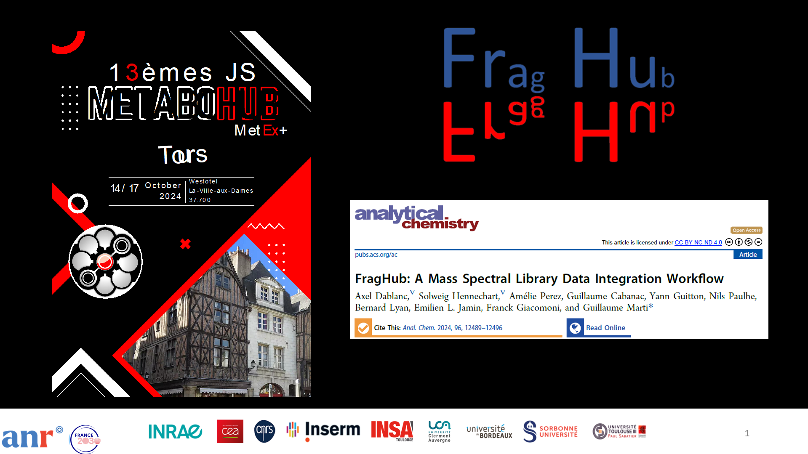
FragHub is a powerful tool designed to standardize and organize mass spectrometry (MS) data from OMSLs (Open Mass Spectra Libraries). The main objective of FragHub is to simplify and improve the process of MS data analysis by providing standardized, consistent, and easily accessible data. 
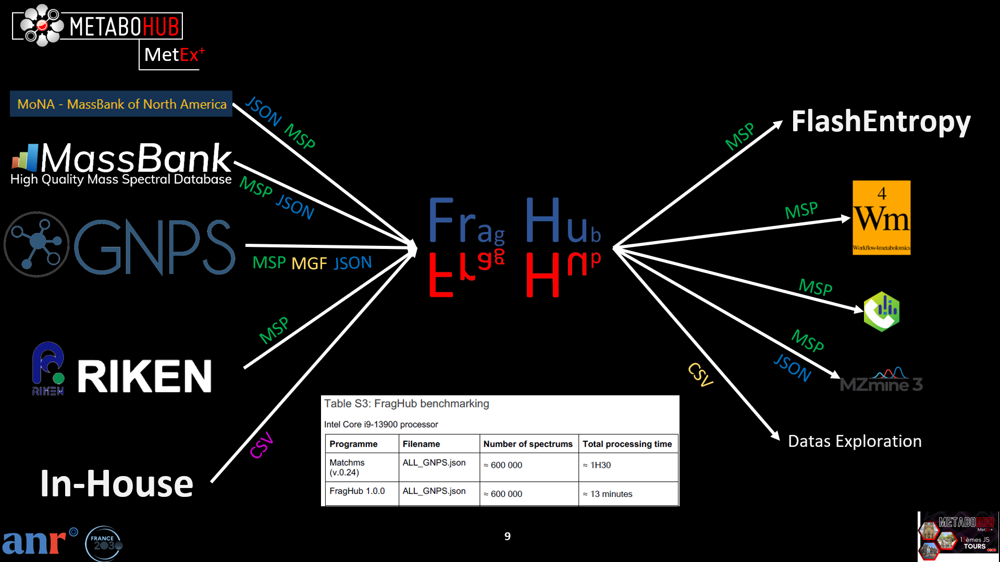
Key features: 
- **Data standardization**: FragHub standardizes field names and values of MS spectra from various databases, ensuring data consistency and compatibility.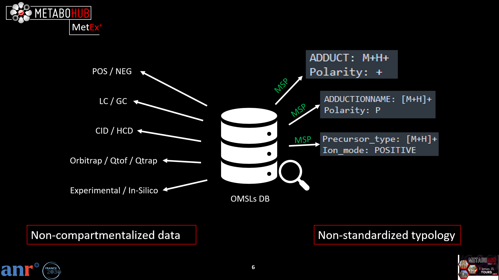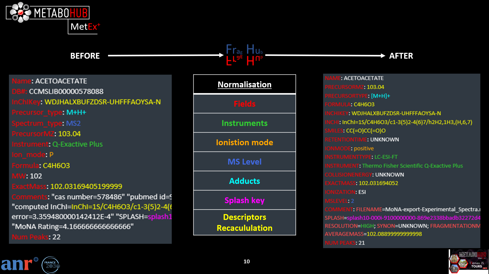
- **Optional peak list filtering**: FragHub applies filters to peak lists to streamline them by retaining only essential data, significantly reducing data size without compromising relevance for analysis.
- **Recalculation and normalization of chemical identifiers**: The program recalculates and normalizes chemical identifiers such as SMILES, InChI, and InChIKey, ensuring a uniform representation of molecular structures.
- **Ontologies**: FragHub complete ontologic information from PubChem datas bases on Inchikey.
- **Spectra organization**: FragHub separates spectra based on different experimental parameters such as polarity (positive/negative), chromatographic mode (LC/GC), and acquisition type (experimental/in silico), facilitating their use and subsequent analysis.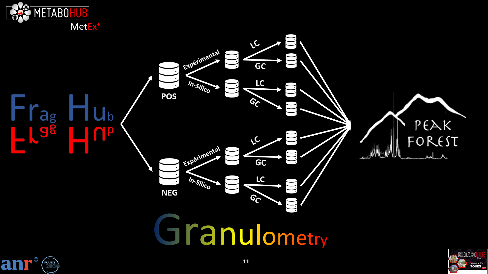
- **Compatibility with various analysis software**: Standardized spectra produced by FragHub are compatible with multiple analysis software, including MSdial, MZmine, and Flash Entropy Search, providing users with maximum flexibility in choosing analysis tools.

**Warning**: All spectra deemed inconsistent, i.e., those lacking SMILES and InChI, precursor m/z, and adduct information, are removed during the processing by FragHub.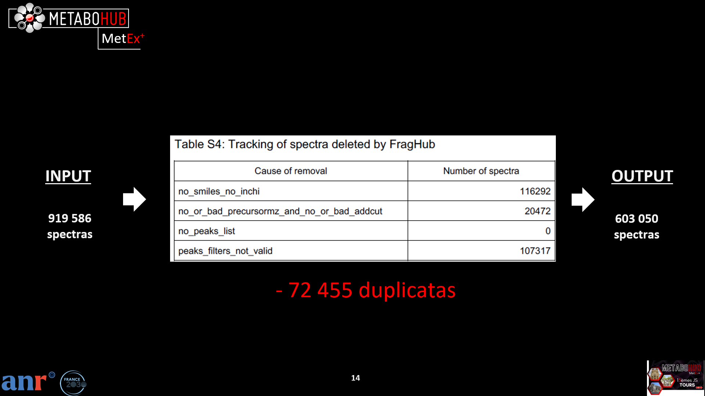

## INSTALLATION

To install all dependencies, double-click on the install script corresponding to your OS. 
NB: **Make sure that python is in the path variables and that you run Python >= 3.12** 

## USE

To use this programme:

1) Double-click on your corresponding OS run script into scripts folder. 
>NB: If you have a file that contains **only** In-Silico spectra AND this is not specified within the filename or the spectrum, you can simply suffix the filename with "_insilico", like this: "UNPD_ISDB_R_p01_insilico.mgf". 
 
>NB: If you have a file that contains **only** GC spectra AND this is not specified within the filename or the spectrum, you can simply suffix the filename with "_GC", like this: "GMD_20111121_MDN35_ALK_MSP_GC.msp". 

2) FragHub GUI start: **at any time you can move the mouse over 🛈 to view a detailed description** 
   1) First tab: Select single or multiple .json, .csv, .msp, or .mgf files. 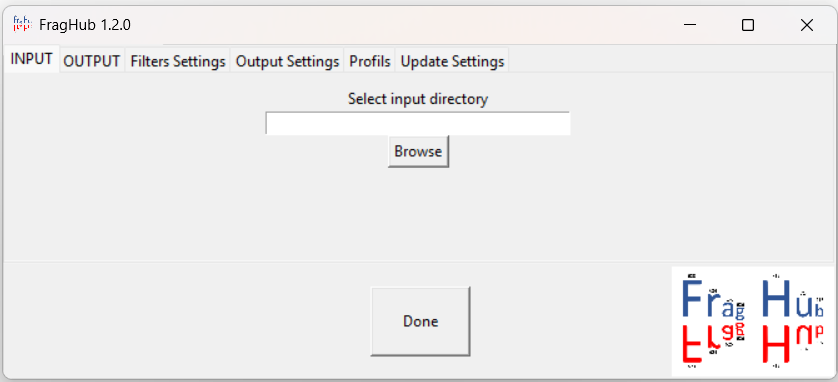
   2) Second tab: Create a new empty directory or Select an existing directory where FragHub has already written files 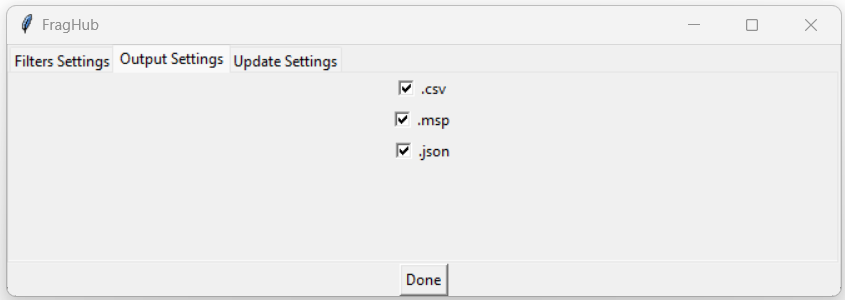
   3) Third tab: This area allows users to select specific filters for inclusion during the processing stage. Moreover, it provides the option to adjust the respective parameters of each filters. 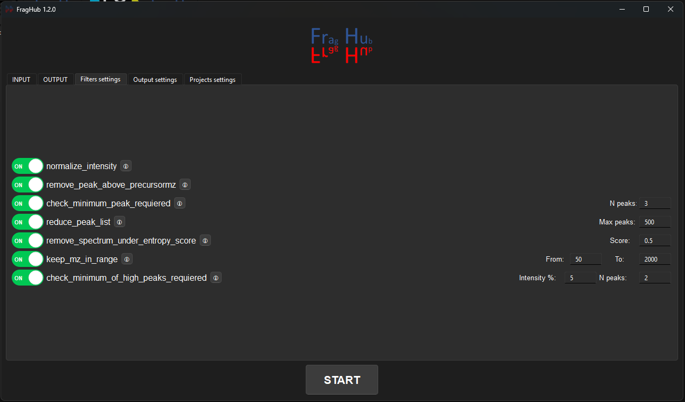
   4) Fourth tab: Select the output file format of your preference. By default, all formats are selected. 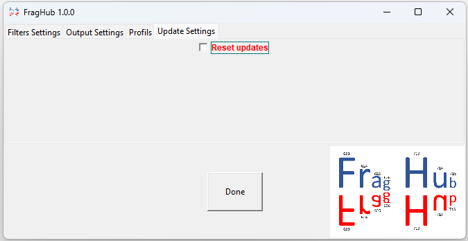
   5) Fifth tab: FragHub save the splash keys of previous spectra processed. So that at the next update, only new spectra from the database are processed, and added to previous FragHub processes. Reseting project allows you to delete splash keys and output files from the selected project, in order to start a new project from scratch. 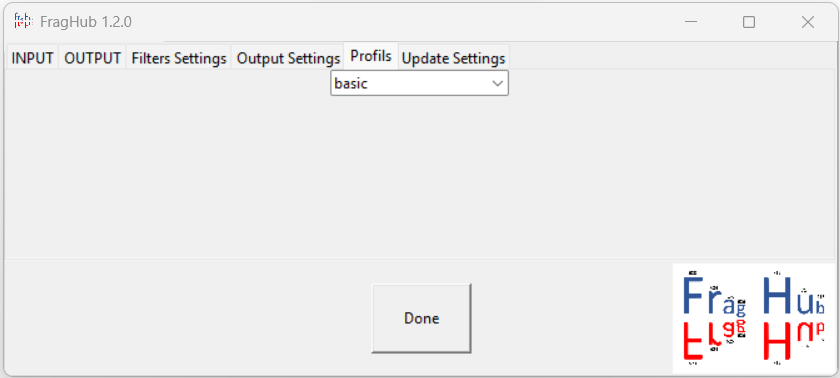
   6) Click on START button to run the programme.
3) Progress start. At any time you can click on STOP button to close the programme. 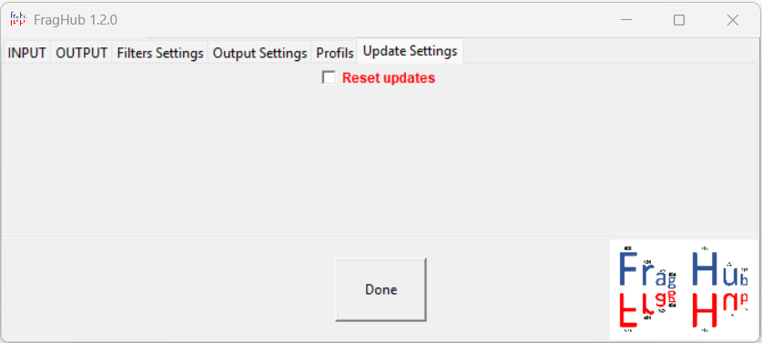
4) When Progress is finish, click on FINISH button to close the programme. 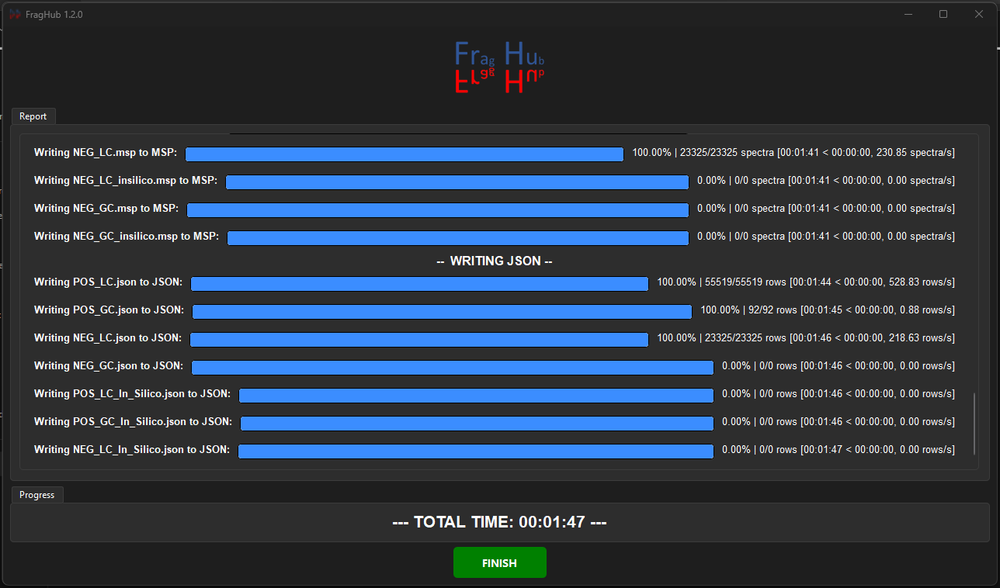
5) **DO NOT DELETE FILES INTO YOUR SELECTED OUTPUT DIRECTORY AFTER COPY CLEANED VERSIONS.**

## FILTERS

**check_minimum_peak_requiered(peak_array, n_peaks)** 
This function checks whether a given mass spectrum contains a minimum number of peaks. If the spectrum contains fewer peaks than the minimum requirement, it ignores the spectrum. 
 
**remove_peak_above_precursormz(peak_array, precursormz)** 
This function removes all peaks from the spectrum whose m/z value is greater than the precursor's m/z value plus 5 Da. 
 
**reduce_peak_list(peak_array, max_peaks)** 
This function reduces the peak list to a specified maximum number of peaks. The peaks to retain are chosen based on their intensity, with peaks of greater intensity being selected. 
 
**normalize_intensity(peak_array)** 
This function normalizes the intensity of all the peaks in a given spectrum to the maximum intensity. 
 
**keep_mz_in_range(peak_array, mz_from, mz_to)** 
This function takes an array of peak data (representing mass-to-charge ratio, or m/z) and returns a new array containing only those peaks whose m/z value falls between mz_from and mz_to. 

**check_minimum_of_high_peaks_requiered(peak_array, intensity_percent, no_peaks)** 
This function is used to check whether a given array containing peak data has a required minimum number of "high peaks". A "high peak" is defined as a peak whose intensity is above a certain percentage (intensity_percent) of the maximum intensity. If the array does not contain a sufficient number of "high peaks", the function ignore the spectrum. 

**remove_spectrum_under_entropy_score(score)** 
The entropy score of the spectrum is calculated during processing. If a spectrum has an entropy score lower than the minimum required, it is deleted. 

## required csv file
1) CSV files need to be separated by '**;**' with quotechar '**"**'. 
2) peaks columns need to be named '**peaks**'. 
3) '**peaks**' column need to be formatted with one of the following format, in string:
   1) >"[[79.054840, 12486.074219], [79.629868, 854.089905]]"
   2) > " 
   57.07042529 0.7697591662 
   71.08607535 1.507457981 
   97.06533991 0.4893302623 
   99.08098997 0.4737337839 
   137.09664 0.498920401 
   165.0915547 0.4243093978 
   " 
>NB: If you want to read CSV from FragHub output, use separator "\t" and parse peaks list with " "(space) like m/z intensity separator and ";" like lines separator (exemple: "314.00000000 1.00000000;315.00000000 0.15715716;316.00000000 0.35735736;317.00000000 0.05105105")
    